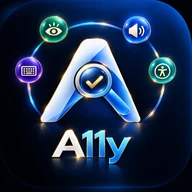
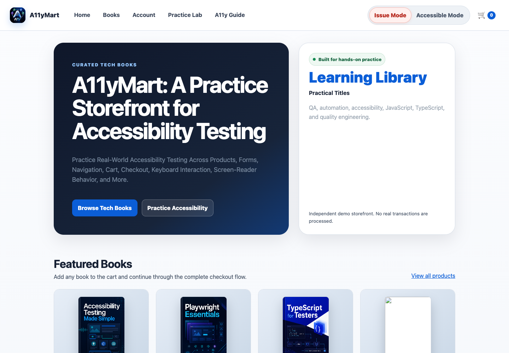
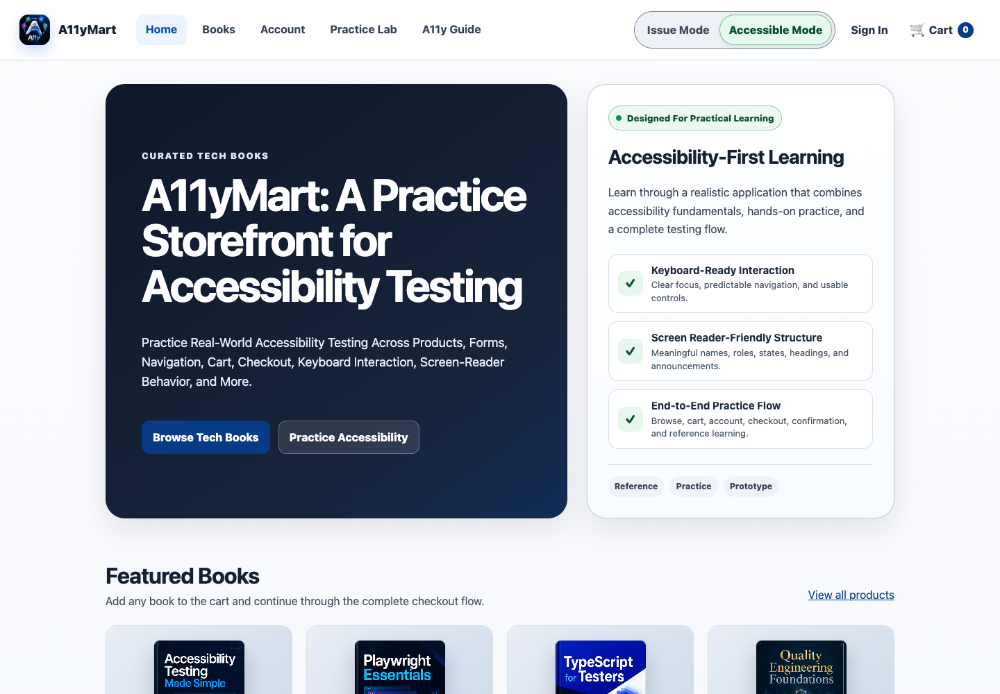
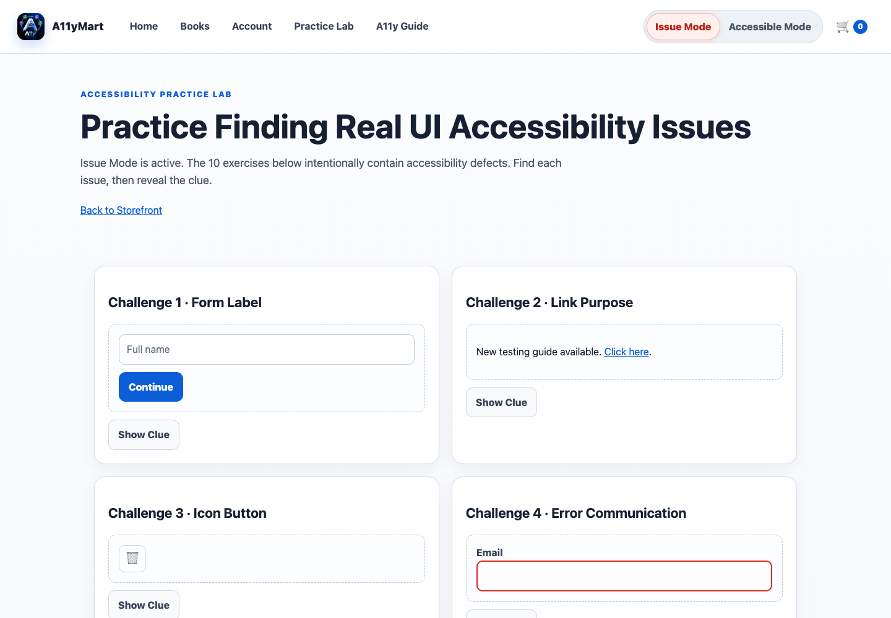
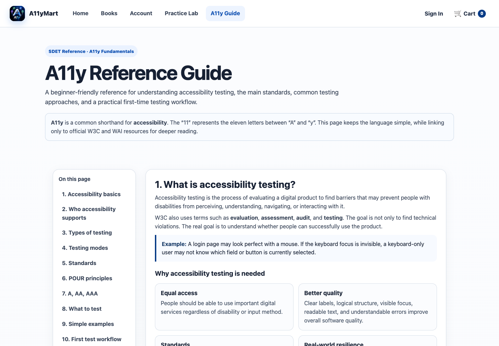

# A11yMart

**A Practice Storefront for Accessibility Testing**

Practice real-world accessibility testing across products, forms, navigation, cart, checkout, keyboard interaction, screen-reader behavior, and more.

  <a href="#run-a11ymart">Run A11yMart</a> ·
  <a href="#how-to-use">How to Use</a> ·
  <a href="#practice-lab">Practice Lab</a> ·
  <a href="#a11y-reference-guide">A11y Guide</a>

  
  
  

---

## About A11yMart

A11yMart is a realistic bookstore-style practice application built for learning and testing web accessibility.

The same application can be explored in two modes:

- **Issue Mode** intentionally contains accessibility problems for testers to identify.
- **Accessible Mode** provides the corrected implementation of those scenarios.

The app includes realistic flows such as product browsing, forms, registration and login, cart management, checkout, payment options, notifications, keyboard interaction, and order confirmation.

Everything runs from a **single index.html file**. No npm install, backend, database, or build step is required.

## Screenshots

### Issue Mode and Accessible Mode

<table>
  <tr>
    <td width="50%"><strong>Issue Mode</strong></td>
    <td width="50%"><strong>Accessible Mode</strong></td>
  </tr>
  <tr>
    <td></td>
    <td></td>
  </tr>
</table>

Issue Mode deliberately includes accessibility defects for practice. Accessible Mode presents the corrected experience for comparison.

### Practice Lab

### A11y Reference Guide

These screenshots were captured from the current standalone app at a 1440 × 1000 desktop viewport.

## Main Features

- Realistic bookstore storefront and end-to-end shopping flow.
- Issue Mode with deliberate accessibility defects.
- Accessible Mode with corrected accessibility implementations.
- Keyboard and focus testing scenarios.
- Form labels, validation, errors, checkboxes, and radio-group examples.
- Image alternative-text scenarios.
- Color contrast and heading-structure examples.
- Dynamic VisualToast and live-status feedback.
- Cart, quantity, checkout, UPI, card, and Cash on Delivery flows.
- Responsive layouts for desktop, tablet, and mobile.
- **10 accessibility Practice Lab challenges.**
- Built-in **A11y Reference Guide** with official W3C/WAI references.

## Run A11yMart

### Option 1 - Download and Open

1. Download [index.html](index.html).
2. Save the file anywhere on the computer.
3. Open it in a modern browser such as Chrome, Edge, Firefox, or Safari.

That is all. A11yMart does not require a server or installation.

### Option 2 - Clone the Repository

    git clone https://github.com/manjunathnp/A11yMart-Test-App.git
    cd A11yMart-Test-App

Open index.html in a browser.

### Option 3 - GitHub Pages

The repository can also be hosted directly with GitHub Pages because the application is a standalone index.html.

In GitHub:

1. Open **Settings → Pages**.
2. Under **Build and deployment**, choose **Deploy from a branch**.
3. Select the default branch and the repository root.
4. Save the configuration.

## How to Use

1. Open A11yMart.
2. The application starts in **Issue Mode**.
3. Explore the storefront and identify accessibility problems.
4. Switch to **Accessible Mode** to compare the corrected behavior.
5. Test the application using keyboard-only navigation.
6. Try registration, login, cart, checkout, payment, and order confirmation.
7. Open the **Practice Lab** for focused accessibility exercises.
8. Use the **A11y Guide** as a quick accessibility-testing reference.

### Demo Login

    Email: demo@a11ymart.local
    Password: Demo@123

Registration also works locally. Demo account, cart, and session information are stored in the browser using local storage.

## Issue Mode vs Accessible Mode

| Area | Issue Mode | Accessible Mode |
| --- | --- | --- |
| Keyboard focus | Intentionally problematic | Clear visible focus |
| Form labels | Missing/broken examples | Correctly associated labels |
| Images | Missing, weak, or broken alternatives | Meaningful alternatives |
| Headings | Intentional hierarchy problems | Logical heading structure |
| Dynamic feedback | Silent or incomplete examples | Visible and assistive-technology feedback |
| Preferred formats | Incorrect single-choice pattern | Independent checkboxes |
| Validation | Accessibility defects included | Clear, associated error messages |
| Cart and checkout | Functionally usable with A11y issues | Accessible end-to-end flow |

The purpose is comparison: **find the problem in Issue Mode, then inspect the corrected behavior in Accessible Mode.**

## Practice Lab

The Practice Lab contains **10 focused accessibility challenges**, including:

1. Form labels
2. Link purpose
3. Icon buttons
4. Error communication
5. Keyboard focus
6. Heading order
7. Image alternative text
8. Color contrast
9. Dynamic status messages
10. Preferred formats

The Practice Lab opens in **Issue Mode by default** so testing can begin immediately.

## A11y Reference Guide

A11yMart includes a built-in beginner-friendly reference guide covering:

- What accessibility testing is
- Why accessibility testing matters
- Types and approaches to accessibility testing
- WCAG and WAI fundamentals
- POUR principles
- WCAG conformance levels
- Common accessibility checks
- Practical examples
- A first-time accessibility testing workflow
- Official W3C/WAI reference links

The reference guide is designed as a learning resource and remains accessible independently of Issue Mode.

## Notes

- A11yMart is a **practice and learning application**, not a real e-commerce store.
- No real payments are processed.
- Local registration and application state stay in the browser.
- Issue Mode defects are intentional.
- Accessible Mode is the reference implementation for the included practice scenarios.
- Generated book-cover images are loaded from their hosted image URLs.

## Project Files

    A11yMart-Test-App/
    ├── index.html                         # Complete A11yMart application
    ├── README.md                          # Usage and project documentation
    ├── logo/
    │   └── a11ymart-logo.webp             # README logo
    └── screenshots/
        ├── a11ymart-issue-mode.png
        ├── a11ymart-accessible-mode.png
        ├── a11ymart-practice-lab.png
        └── a11ymart-a11y-guide.png

## Developed By

**Manjunath N P**

- Website: [manjunathnp.in](https://manjunathnp.in)
- GitHub: [github.com/manjunathnp](https://github.com/manjunathnp)
- LinkedIn: [linkedin.com/in/manjunathnp](https://www.linkedin.com/in/manjunathnp)

---

A11yMart is intended for accessibility learning, testing practice, demonstrations, and quality-engineering education.
